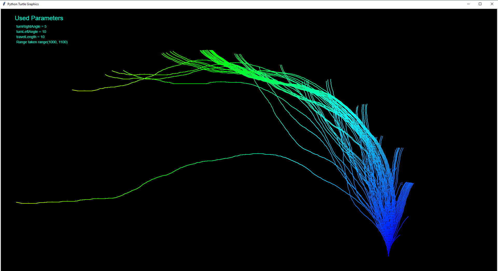

# collatzConjecture
A project for Drawing Collatz Conjecture visualizer

Collatz Conjecture has not been proven yet.
It states that any positive integer you pick will enentually be reduced to 1 following only 2 rules.
- If the number is even divide it by 2
- If it's odd, multiply 3 and add 1

If you repeat these two operation you will reach 1 eventually. 
Though it's not been proven right, it also has not been proven wrong.  
But mathematicians have tested by brute force every single number upto 268 and none of them disproves the conjecture

In this program I tried to generate a visual on what's going on.

Here's a sample photo

  

